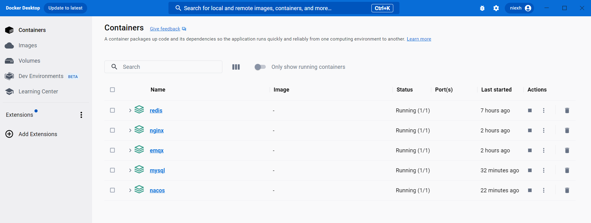

# docker-compose-examples文档

## 简介
提供linux和windows下docker-compose组件部署样例，帮助快速搭建开发环境。

## 使用
根据要部署的环境，分别拷贝linux和windows下的docker文件夹到安装目录，linux拷贝至根目录/下，windows拷贝至e盘下。
然后进入对应的组件文件夹，执行docker-compose up -d构建容器。


## 目录结构说明
```
source
    -linux -- linux环境下部署样例
        -docker -- docker目录，部署时将该目录整体拷贝到linux下的根目录/
            -组件 -- 组件目录
                -conf   --配置文件
                -docker-compose.yml 
    -windows -- windows环境下部署样例
        -docker -- docker目录，部署时将该目录整体拷贝到windows下的e盘
            -与linux下结构相同
```
windows下使用docker-compose强烈推荐docker desktop，可以很方便的一键管理自己的windows下的docker容器。成功安装并启动docker desktop后，在windows的powershell中即可使用docker相关命令。
组件安装完毕后，界面效果如下：



## 注意
1. windows下部署mysql时需将conf/my.cnf设置为只读，否则my.cnf配置不会生效。
2. 每个组件对应的配置文件请在构建前按自己实际情况修改，192.168.0.154为我本机ip，请修改成自己机器ip